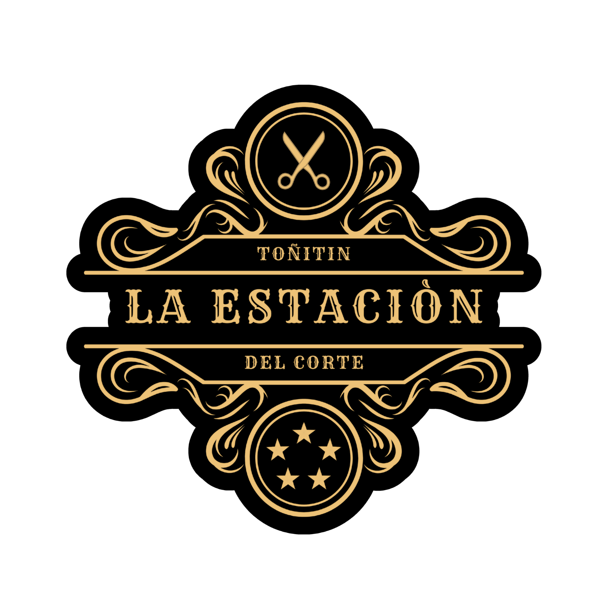

<!DOCTYPE html>
<html lang="es">
<head>
  <meta charset="UTF-8">
  <meta name="viewport" content="width=device-width, initial-scale=1.0">
  <title>Toñitín La Estación del Corte - Agenda tu Cita</title>
  
  
</head>
<body>
  <header>
    
    <h1>Toñitín - La Estación del Corte</h1>
    
Más calidad, más confort ✂️

  </header>
  <main>
    <h2>Reserva tu cita aquí</h2>
    <form onsubmit="enviarWhatsApp(event)">
      <label>Nombre completo:
        <input type="text" name="nombre" required>
      </label>
      <label>WhatsApp:
        <input type="tel" name="telefono" required>
      </label>
      <label>Fecha de la cita:
        <input type="date" name="fecha" required>
      </label>
      <label>Hora:
        <input type="time" name="hora" required>
      </label>
      <label>Servicio:
        <select name="servicio" required>
          <option value="Recorte normal">Recorte normal</option>
          <option value="Corte completo">Corte completo</option>
          <option value="Solo cerquillo">Solo cerquillo</option>
          <option value="Corte para niños">Corte para niños</option>
        </select>
      </label>
      <label>Comentarios:
        <textarea name="comentarios" rows="3"></textarea>
      </label>
      <button type="submit">Reservar cita por WhatsApp</button>
    </form>
  </main>
  <footer>
    
&copy; 2025 Toñitín - La Estación del Corte. Todos los derechos reservados.

  </footer>
</body>
</html>
